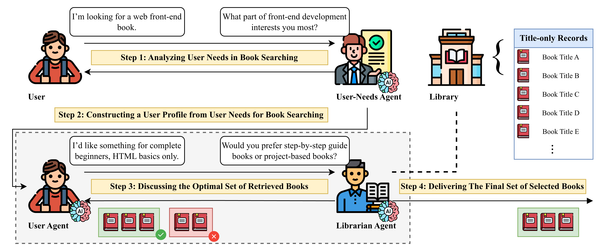

# Smart Book Seeker: Agent-Augmented Retrieval System for Metadata-Sparse Libraries
This repository contains the implementation of the Smart Book Seeker: Agent-Augmented Retrieval System for Metadata-Sparse Libraries (SBS-AARS), designed to enhance book retrieval in modern libraries facing challenges due to sparse metadata.

## Framework

Workflow of the Smart Book Seeker Agent-Augmented Retrieval System for Metadata-Sparse Libraries (SBS-AARS). The system operates through four coordinated steps:

1. The User-Needs Agent clarifies ambiguous search requirements through interactive dialogue with the user.
2. A structured user profile is constructed from the clarified needs.
3. The User Agent and Librarian Agent engage in multi-turn collaborative discussions, where the Librarian Agent generates and executes keyword-based search queries against the library collection, and the User Agent evaluates retrieved books by accepting or rejecting candidates based on their alignment with user requirements.
4. The final curated set of books is delivered to the user.

The dashed box highlights the core Librarian Agent-User Agent Discussion Mechanism, which enables iterative refinement of retrieval strategies through reasoning-based dialogue.

## Prerequisites
Before running the SBS-AARS (including experiments), ensure you have installed [ElasticSearch](https://github.com/elastic/elasticsearch) for simulating realistic search scenarios and [Analysis-IK](https://github.com/infinilabs/analysis-ik) for chinese text tokenization. Make sure to set up your `.env` file with the necessary configuration parameters before proceeding.

## Project Structure
- `src/smart_book_seeker/`: Main source code for the Smart Book Seeker system.
- `src/smart_book_seeker/agents/`: Contains the implementation of various LLM agents including User-Needs Agent, User Agent, and Librarian Agent.
- `data/`: Contains books for creating simulated real library scenarios.
- `notebooks/`: Scripts and configurations for running experiments.
- `results/`: Stores the results of experiments.

## License
This work is licensed under a Creative Commons Attribution 4.0 International License. See the [LICENSE](LICENSE) file for details.